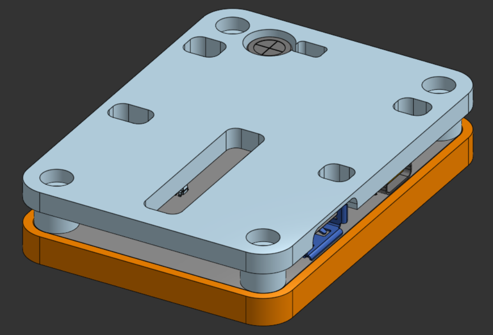
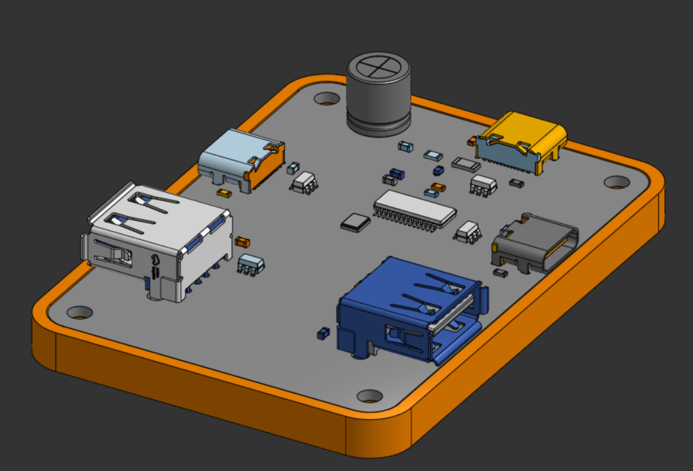

# skibidi phone usb hub

a very skibidi usb hub for my google pixel 7. powered by the fe1.1s and will power, providing 1 upstream usb c port, 2 downstream usb c ports, and 2 downstream usb a ports!!

[\[Blueprint\]](https://blueprint.hackclub.com/projects/13784) | [\[KiCanvas\]](https://kicanvas.org/?repo=https%3A%2F%2Fgithub.com%2Ftobycm%2Fskibidi-phone-usb-hub%2Ftree%2Fmain%2Fpcb) | [\[Onshape\]](https://cad.onshape.com/documents/10b57464fda6e11087981088/w/324a5dd08e96a242cfbf7cb1/e/a8a34f6420c32109d6a4c98d)

### Update (Mar 21 2026 13:08 PST)

Going to drop the big bulk capacitor as that might cause too much inrush current. Each 10uF at each port should be enough, adds up to 50uF for VBUS.

Updated .step file: removed cutout for bulk capacitor.

## PCB

4 Layer PCB, stackup JLC04161H-7628 from JLCPCB

## CAD

Onshape Model Link: https://cad.onshape.com/documents/10b57464fda6e11087981088/w/324a5dd08e96a242cfbf7cb1/e/a8a34f6420c32109d6a4c98d

## BOM

| Description | Quantity | Part # | Unit price | Extended Price USD | Product Link |
| :--- | :--- | :--- | :--- | :--- | :--- |
| 4 USB 2.0 SSOP-28-150mil Interface Controllers RoHS | 10 | FE1.1S-BSOP28BCN | 0.5383 | 5.38 | [Link](https://www.lcsc.com/product-detail/C9359.html) |
| 10uF ±20% 25V Ceramic Capacitor X5R 0603 | 100 | CL10A106MA8NRNC | 0.0176 | 1.76 | [Link](https://www.lcsc.com/product-detail/C96446.html) |
| 2.7kΩ ±1% 100mW 0603 Thick Film Resistor | 100 | FRC0603F2701TS | 0.0011 | 0.11 | [Link](https://www.lcsc.com/product-detail/C2907008.html) |
| Crystal 12MHz ±10ppm 12pF SMD3225-4P | 20 | XL2EL89COI-111YLC-12M | 0.0643 | 1.29 | [Link](https://www.lcsc.com/product-detail/C5280578.html) |
| 5.1kΩ ±1% 100mW 0603 Thick Film Resistor | 100 | FRC0603F5101TS | 0.0012 | 0.12 | [Link](https://www.lcsc.com/product-detail/C2907044.html) |
| 12VC Clamp 6A Ipp ESD DIODE SOT-23-6 | 70 | USBLC6-2SC6 | 0.0403 | 2.82 | [Link](https://www.lcsc.com/product-detail/C2827654.html) |
| USB-A (USB TYPE-A) Receptacle Connector 4 Position Right Angle | 30 | AF 90 WJDG | 0.0471 | 1.41 | [Link](https://www.lcsc.com/product-detail/C456018.html) |
| USB-C (USB TYPE-C) Receptacle Connector 16 Position Surface Mount | 40 | TYPE-C 16PIN 2MD(073) | 0.0617 | 2.47 | [Link](https://www.lcsc.com/product-detail/C2765186.html) |
| 25V 470uF 1.6A@100kHz 20mΩ Aluminum - Polymer Cap | 5 | PH25V470M8X11 | 0.2282 | 1.14 | [Link](https://www.lcsc.com/product-detail/C49232874.html) |
| 56kΩ ±1% 100mW 0603 Thick Film Resistor | 100 | 0603WAF5602T5E | 0.0013 | 0.13 | [Link](https://www.lcsc.com/product-detail/C23206.html) |
| ESD DIODE 5VWM 18.6VC SOD-523 (Owned) | 0 | ESD5Z5.0T1G | 0.0354 | 0 | [Link](https://www.lcsc.com/product-detail/C82044.html) |
| PTC RESET FUSE 12V 2A 1206 (Owned) | 0 | BSMD1206-200-12V | 0.0612 | 0 | [Link](https://www.lcsc.com/product-detail/C883135.html) |
| FERRITE BEAD 220Ω 0805 1LN (Owned) | 0 | BLM21PG221SN1D | 0.023 | 0 | [Link](https://www.lcsc.com/product-detail/C85840.html) |
| LCSC Shipping | 1 | LCSC Shipping | 14.67 | 14.67 | [Link](https://www.lcsc.com/) |
| 4 Layer PCB | 10 | PCB | 2.3 | 23 | [Link](https://jlcpcb.com/) |
| Stencil | 1 | Stencil | 3.05 | 3.05 | [Link](https://jlcpcb.com/) |
| JLCPCB Shipping | 1 | JLCPCB Shipping | 10.08 | 10.08 | [Link](https://jlcpcb.com/) |
| 150pcs Nylon Standoff/Screw Kit | 1 | 1005002059852181 | 4.07 | 4.07 | [Link](https://www.aliexpress.com/item/1005002059852181.html) |
| Aliexpress Shipping | 1 | Aliexpress Shipping | 2.04 | 2.04 | [Link](https://www.aliexpress.com) |
| **Total** | | | | **73.54** | |

 <a href="https://github.com/tobycm">tobycm</a>

This project was funded by [Blueprint](https://blueprint.hackclub.com/), a grant program by Hack Club that supports open source hardware projects for teenagers.
